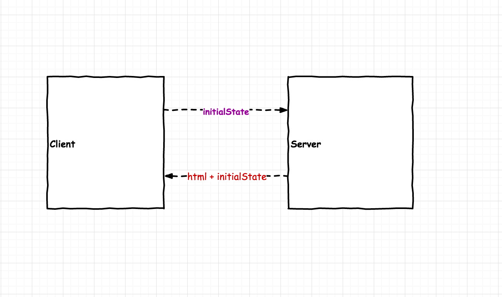

## Server Rendering

### 客户端渲染
 
这里的 **客户端渲染** 是指客户端通过 ajax 从后端取得数据, 然后进行渲染。主要造成了以下两个问题:
  
1. SEO问题，爬虫抓取不到内容
2. 初始化渲染速度比服务器慢, 要等 js 加载完之后才能渲染

### 服务端渲染

服务端渲染最常见的使用场景是用来做初始渲染 __*initial render*__, 用来提升首次加载 app 的速度, 同时也便于 SEO

#### 原理

* 客户端和服务器共享部分代码(isomorphic)
* 客户端将 `initialState` 发给服务器
* 服务器根据 `initialState`将 html render 出来
* 服务器将 `html` 和 `initialState` 发给客户端

### Redux on the Server

 
 

